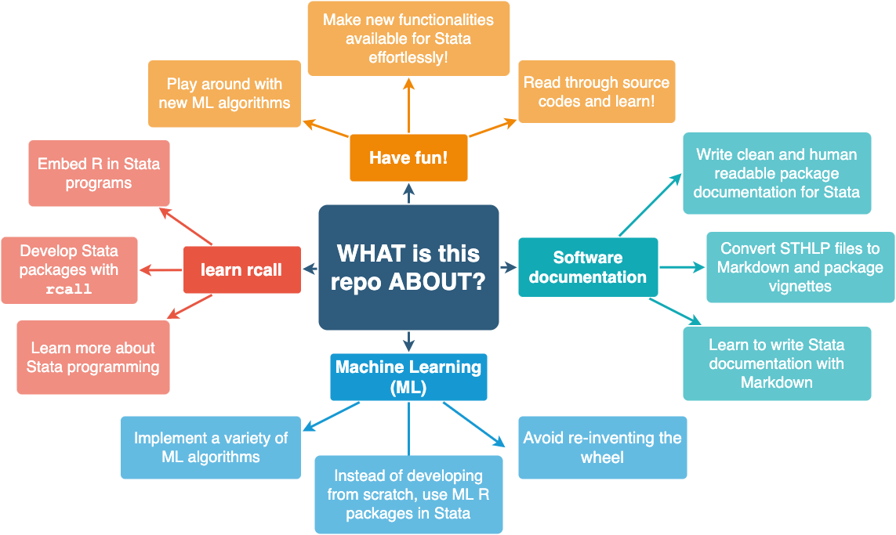

Integrating R machine learning algorithms in Stata using rcall 3.0: a tutorial for Stata users and developers
===============

> __Cite__: Haghish, E. F. (in preparation). Integrating R machine learning algorithms in Stata using rcall 3.0: 
a tutorial for Stata users and developers


If you interested in reading the source code of this package, contributing to this project, or develop your own 
__R__-based Stata packages, I suggest you to read the following articles. These articles provide the background 
to embed __R__ code in __Stata__, write easy-to-read and elegant software documentation, and host your packages
on GitHub. 

- Haghish, E. F. (2019). [Seamless interactive language interfacing between R and Stata](https://journals.sagepub.com/doi/10.1177/1536867X19830891).  
The Stata Journal. 2019;19(1):61-82.

- Haghish, E. F. (2020). [Software documentation with markdoc 5.0](https://journals.sagepub.com/doi/full/10.1177/1536867X20931000).  
The Stata Journal. 2020;20(2):336-362.

- Haghish, E. F. (2020). [Developing, maintaining, and hosting Stata statistical software on GitHub](https://journals.sagepub.com/doi/10.1177/1536867X20976323?icid=int.sj-full-text.similar-articles.1).  
The Stata Journal. 2020;20(4):931-951.

What is this repository about? 
------------------------------

The title of the repository reads __machne learning__, but this repository is much more than just a machine learning repository. It's a place for learning advanced - but simple - Stata programming using __rcall__ and __markdoc__. __rcall__ is the main engine of the package, used for embedding R machine learning packages in Stata programs. __markdoc__ plays a central role in software documentation... [to be continued]



How to get started?
-------------------

1. Each program is written in a seperate _ADO_ file, named after the program. 
2. The _Markdown_ documentation of each program is written within the script file. 
3. The __make.do__ file is the package generator file. It's a program installed with [__`github package`__](https://github.com/haghish/github)
4. The __make.do__ also generates Stata help files, Markdown help files (for GitHub Wiki), and PDF package Vignette
5. All of these documents are generated with [`MarkDoc`](https://github.com/haghish/markdoc) literate programming package
6. You will find the package vignette template in __vignette.do__ file

Description
-----------

The `machinelearning` package is a Stata module including several R machine learning (ML) algorithms, implemented in 
Stata using [`rcall`](https://github.com/haghish/rcall) package. The reason for developing this package is twofold:

- Bringing several machine learning R packages to Stata and making them available to the community
- Provide a simplistic tutorial and a real-world example showing how to 
  + embed intricate R code into Stata _Ado programs_ 
  + document Stata _Ado programs_ with Markdown language using [`MarkDoc`](https://github.com/haghish/markdoc) literate programming package 
  + build Stata package using [`MarkDoc`](https://github.com/haghish/markdoc)

Installation
------------

The [__`github package`__](https://github.com/haghish/github) is the only recommended way for installing **`machinelearning`**. Once [__`github`__](https://github.com/haghish/github) is installed, you can install the development version of the package as follows. Currently, the package is _work-in-progress_ 
and there is no stable release yet. 

```js
github install haghish/machinelearning
```

Programs
========

`missforest`: Missing data imputation with Random Forest 
--------------------------------------------------------

`missforst` embeds the [missForest](https://cran.r-project.org/web/packages/missForest/index.html) R package in Stata. 
This is a very simple - yet very powerful - missing data imputation that can provide unbised Out Of Bag (OOB) 
error estimation for each variable. Load your dataset in Stata and call the command! The imputed data will 
be loaded automatically in Stata once the imputaion is done. 
[continue reading on GitHub Wiki ...](https://github.com/haghish/machinelearning/wiki/missforest)

`kNN`: Missing data imputation with kNN algorithm 
--------------------------------------------------------

Missing values are inseperable parts of large datasets. However, the larger the data, daily imputation methods 
such as multiple imputation and even faster variations, such as Random Forest imputation is less feasible or 
infeasible. This is when faster algorithms shine, especially __kNN__. This package includes a Stata program 
that implements the __kNN__ algorithm using using [`rcall`](https://github.com/haghish/rcall). [continue reading on GitHub Wiki ...](https://github.com/haghish/machinelearning/wiki/knn)

